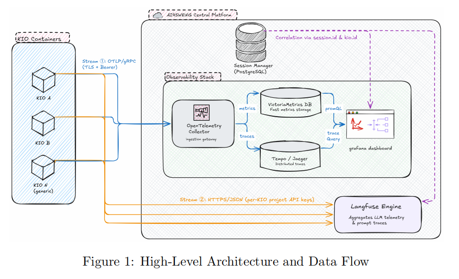

# AI4SWENG Observability Stack


**Notion Documentation: [AI4SWENG Observability - Grafana Metrik Sistemi](https://app.notion.com/p/dawn-squash-710/Observability-Grafana-Metrik-Sistemi-3a619cd5a4d88093a1fdebd6ada75f5a)**

Local implementation of the **[AI4SWENG Observability Integration Contract v1.0](observability_integration_contract.pdf)**
(normative, issued by the Central Platform Team to all KIO Consortium teams KIO2–KIO13
— read this first if you're integrating a new KIO). KIO modules push telemetry over
OTLP; the central platform stores it and Grafana visualizes it. Everything runs
locally via Docker Compose.


<div align="center">

  

</div>


```
                 OTLP/gRPC (:4317)
  KIO2 ┐                              ┌─ metrics ─► VictoriaMetrics (:8428) ─┐
  KIO3 ├──►  OpenTelemetry Collector ─┤─ logs ────► VictoriaLogs    (:9428) ─┼─► Grafana (:3000)
  KIO4 ┘                              └─ traces ───► Tempo           (:3200) ─┘
       │
       └──────────────────────────────► Langfuse (:3001, HTTPS, parallel stream)
       (dummy telemetry)
```

## What's inside

| Component | Role | Port |
|-----------|------|------|
| `otel-collector` | Single OTLP ingestion gateway; fans metrics → VictoriaMetrics, logs → VictoriaLogs, traces → Tempo | 4317 (gRPC), 4318 (HTTP) |
| `victoriametrics` | Metrics store (Prometheus-compatible, no Prometheus needed) | 8428 |
| `victorialogs` | Store for unstructured / string telemetry | 9428 |
| `tempo` | Trace store (monolithic mode, local disk) — powers the "işlem sırası" waterfall view | 3200 |
| `grafana` | Dashboards (auto-provisioned) | 3000 |
| `langfuse-web` / `langfuse-worker` | Self-hosted Langfuse — LLM-specific prompt/completion/cost tracing, a stream parallel to and independent of OTel | 3001 (UI+API), internal 3030 (worker) |
| `postgres` / `clickhouse` / `redis` / `minio` | Langfuse's own required backing stores (relational DB, trace analytics, queue, blob storage) — not something we chose, this is Langfuse's mandated self-host footprint | internal only (127.0.0.1-bound except minio :9090) |
| `nats` | JetStream message broker — how KIOs get *triggered* (orchestration layer, see below). Separate concern from the OTel/Langfuse pipeline above | 4222 (client), 8222 (monitoring) |
| `orchestrator-postgres` | Session Manager's own dedicated DB (session + lineage records) — separate from Langfuse's Postgres | internal only |
| `workflow-api` | HTTP entry point to trigger a task (`POST /workflow/run`) | 8080 |
| `planner` | Long-running service: registers lineage as worker KIOs report results over NATS | — |
| `kio2-sim` / `kio3` / `kio4` | KIO simulators pushing contract-compliant dummy telemetry, dual-written to OTel + Langfuse. `kio2-sim` runs on its own internal timer (real-Ollama demo); `kio3`/`kio4` are NATS-driven | — |

The KIOs never run their own collector, never expose a scrape endpoint, and never
touch a database directly — exactly as the contract requires.

## Quick start

```bash
cd observability
docker compose up -d --build
```

Then open **http://localhost:3000** (login `admin` / `admin`, anonymous access is
also on). Two dashboards appear under the **AI4SWENG** folder:

- **AI4SWENG — Overview (All KIOs)**: aggregate stats across every KIO — request &
  error rates, latency p95, token throughput, tokens/sec, GPU energy, cost, accuracy.
- **AI4SWENG — KIO Detail**: pick a KIO from the `KIO` dropdown; per-KIO metrics, a
  live panel of that KIO's unstructured string logs, and a **traces** section — a
  table of recent traces plus a waterfall view of the selected one (copy a Trace ID
  from the table into the `trace_id` box above it). Further down: a **gauge view**
  (colored green/orange/red bands, mirroring an external dashboard reference the
  team liked) for error rate, tokens/sec, and accuracy; a **power/efficiency/carbon**
  row (Watts, tokens-per-Watt, and an estimated kg-CO2e derived from energy — all
  pure PromQL, no new instrumentation); a **real GPU temperature** gauge (only
  populated when `KIO2_REAL_LLM_ENABLED=true` and NVML/power-exporter is reachable —
  "No data" otherwise is expected, not a bug); and a **simulated vs. real**
  before/after bar-chart row (energy, tokens/sec, latency) split by the `source`
  label.

Give it ~30–60 seconds after startup for the first metrics and traces to land.

Separately, **http://localhost:3001** opens the Langfuse UI (login
`admin@ai4sweng.local` / `ai4sweng-admin`, auto-created on first boot — see
Headless Initialization below). Langfuse takes noticeably longer to become ready
than the rest of the stack (~2–3 minutes: it's booting Postgres + ClickHouse +
Redis + MinIO underneath it) — the KIOs will log harmless connection-refused
retries against it until it's up, then start landing traces automatically.

Tear down (and wipe data): `docker compose down -v`

## The six KIO simulators

| KIO | LLM | Task type | Trigger | Notes |
|-----|-----|-----------|---------|-------|
| kio2-sim | `qwen2.5:3b` | code-analysis | internal timer | also reports **real** repo line/dir/file counts; **real Ollama tok/s + real GPU energy/temperature** (`KIO2_REAL_LLM_ENABLED=true`, see below). `kio2` itself is reserved for the real FocusTracer module — see `kio2-integration/README.md` |
| kio3 | `llama3.1:8b` | nlp-requirements (D1.1's KIO3) | internal timer **+** NATS (`kio.tasks.kio3`) | random dummy telemetry; D1.1 KPI 1.1 + 3.1 (simulated, `KIO_REAL_KPI_ROLE=nlp-requirements`) |
| kio4 | `gpt-4o-mini` | architecture-to-code (D1.1's KIO4) | internal timer **+** NATS (`kio.tasks.kio4`) | random dummy telemetry (non-zero cost); D1.1 KPI 1.1 + 3.1 + 3.2 (simulated, `KIO_REAL_KPI_ROLE=architecture-to-code`) |
| kio7 | `claude-sonnet` | ai-sysdev (D1.1's KIO7) | internal timer **+** NATS (`kio.tasks.kio7`) | random dummy telemetry; D1.1 KPI 4.1 + 5.1 + 7.1 + 9.1 + 9.2 (simulated, `KIO_REAL_KPI_ROLE=ai-sysdev`) — only the KPIs where KIO7 is a clear primary owner, not the full "most KPIs" D1.1 assigns it |
| kio8 | `gemini-1.5-pro` | green-deploy (D1.1's KIO8) | internal timer only (no NATS) | random dummy telemetry; D1.1 KPI 2.1 + 2.2 + 8.3 (simulated, `KIO_REAL_KPI_ROLE=green-deploy`) |
| kio13 | `gpt-4o-mini` | adoption (D1.1's KIO13) | internal timer only (no NATS) | random dummy telemetry; D1.1 KPI 8.1 + 8.2 (simulated, `KIO_REAL_KPI_ROLE=adoption`) — the only two D1.1 KPIs mapped to a single KIO with no co-owner |

`task_type` for kio3/kio4 was renamed 2026-08 from the arbitrary
`test-generation`/`debug` to match D1.1's actual KIO3/KIO4 identities, once
it became clear the D1.1 KPI traceability matrix's assignments (KPI 1.1, 3.1,
3.2) are keyed to those real roles, not to whatever this simulator happened
to call them first. kio7, kio8, kio13 were added the same way directly
against D1.1's KIO7/KIO8/KIO13 identities — kio8/kio13 close out D1.1's last
two uncovered KPIs (2.1/2.2/8.3 and 8.1/8.2). kio8/kio13 skip the NATS
trigger path since they have no real dispatch target behind them yet (see
the orchestrator's task_type routing table) — pure KPI simulators, timer-only.

kio3/kio4/kio7/kio8/kio13 are otherwise still random dummy data — no real LLM
is invoked for them. NATS-driven dispatch (via the Workflow API/Planner) is an
*additional* trigger path for kio3/kio4/kio7, not a replacement for the
internal timer — an earlier cut made it either/or, which meant these KIOs
went completely silent ("No data" everywhere) whenever nothing happened to
call the Workflow API. Both paths now run side by side for those three, so
they always keep producing baseline demo data. Adjust LLMs, task types, and
rates in `docker-compose.yml`, or edit `kio-simulator/kio_simulator.py`.

### Gerçek vs Simüle Veri Haritası

Hangi panelin/metriğin ne zaman gerçek, ne zaman simüle (dummy) olduğu — hepsi
`source=real|simulated` etiketiyle Grafana'da da ayırt edilebilir (yeşil=real,
turuncu=simulated, bkz. "Veri kaynağı" paneli):

| Metrik / Panel | kio2-sim (`KIO2_REAL_LLM_ENABLED=false`) | kio2-sim (`=true`) | kio3 / kio4 |
|---|---|---|---|
| tok/s, `kio.llm.tokens_per_second` | simüle | **gerçek** (Ollama `eval_count/eval_duration`) | her zaman simüle |
| Enerji (W/J), `kio.llm.energy_joules` | simüle (model-başı sabit katsayı) | **gerçek** (NVML / `tools/power_exporter.py`) | her zaman simüle |
| GPU sıcaklığı, `kio.llm.gpu_temperature_celsius` | veri yok ("No data") | **gerçek** (NVML/power-exporter erişilebilirse) | veri yok (GPU'ları yok) |
| Hata oranı, `kio.request.error_count` | simüle (~%7 rastgele) | **gerçek** (gerçek Ollama başarı/hata) | her zaman simüle (~%7 rastgele) |
| Repo satır/dizin/dosya sayısı | **gerçek** (kendi kaynağını tarar) | **gerçek** | uygulanamaz (code-analysis değiller) |
| Accuracy / fix@1, `kio.request.accuracy` | her zaman simüle | her zaman simüle (Ollama gerçek olsa bile) | her zaman simüle |
| D1.1 KPI'ları (bug-fix time, issue resolution, slicing success, customer-reported) | her zaman simüle (yalnızca kio2-sim'de, `KIO_REAL_KPI_ROLE=bugfix`) | her zaman simüle | uygulanamaz (kio3/kio4'ün rolü farklı — bkz. aşağıki satır) |
| D1.1 KPI'ları (codegen duration, code quality, review score) | uygulanamaz (bu KPI'lar kio3/kio4'e özel) | uygulanamaz | her zaman simüle (`KIO_REAL_KPI_ROLE=nlp-requirements`/`architecture-to-code`) |
| D1.1 KPI'ları (dev productivity, time-to-market, cost saving, refactoring/tech-debt reduction) | uygulanamaz (bu KPI'lar kio7'ye özel) | uygulanamaz | uygulanamaz — yalnızca **kio7**'de, her zaman simüle (`KIO_REAL_KPI_ROLE=ai-sysdev`) |
| D1.1 KPI'ları (lifecycle energy, deploy energy efficiency, cross-arch build success) | uygulanamaz (bu KPI'lar kio8'e özel) | uygulanamaz | uygulanamaz — yalnızca **kio8**'de, her zaman simüle (`KIO_REAL_KPI_ROLE=green-deploy`) |
| D1.1 KPI'ları (adoption rate, active usage, satisfaction/MOS) | uygulanamaz (bu KPI'lar kio13'e özel) | uygulanamaz | uygulanamaz — yalnızca **kio13**'te, her zaman simüle (`KIO_REAL_KPI_ROLE=adoption`) |
| Kümülatif CO2e (tahmini) | simüle enerjiden türetilmiş tahmin | gerçek enerjiden türetilmiş tahmin (kendisi hâlâ bir tahmin, gerçek karbon ölçümü değil) | simüle enerjiden türetilmiş tahmin |

fix@1 ve tüm D1.1 proje-KPI'ları hiçbir KIO'da "gerçek" olmuyor çünkü bunların
gerçek kaynağı ilgili gerçek modülün kendisi (KIO2/FocusTracer için Bölüm 9.7/9.8,
`kio2-integration/README.md`; KIO3/KIO4'ün gerçek modülleri henüz yok) — bağlantı
kurulana/modül gelene kadar burada üretilen her şey bilinçli olarak simüle kalıyor,
"beklenirken boş panel" yerine "açıkça etiketlenmiş dummy veri" tercih edildi.

Each simulated request also emits a **trace**: a root `kio.request` span with
sequential child spans — `prepare_prompt` → `llm_call` → `postprocess` (code-analysis
KIOs add a leading `repo_scan` span). Timestamps are set explicitly to mirror the
request's real latency breakdown, so the waterfall in Grafana reflects the actual
timing split, not a fixed mock.

## Orchestration layer (NATS JetStream) — how KIOs get triggered

Per the v2 guideline's architecture (Workflow API → Session Manager → Planner →
NATS JetStream → worker KIO → NATS → Planner → Session Manager lineage), this is now
implemented — see `orchestrator/`. This is a **separate concern from observability**:
it's about how a task gets *dispatched* to a KIO, not how that KIO reports telemetry.
A worker KIO's OTel/Langfuse instrumentation is identical either way.

```
POST /workflow/run  ──►  workflow-api  ──► Session Manager (Postgres: sessions)
                              │                      ▲
                              ▼                      │ lineage
                          Planner ──► NATS JetStream ──► worker KIO (kio3/kio4)
                              ▲                              │
                              └──────── kio.results.* ◄──────┘
```

- **`orchestrator/envelope.py`** — `KIOEnvelope` (task_type, session_id, kio_id, payload)
  and `KIOResult` (status, output, error). Vendored, byte-for-byte, into
  `kio-simulator/envelope.py` too, so kio-simulator's Docker build context doesn't need
  to change (see comment in that file for why).
- **`orchestrator/session_manager.py`** — registers sessions and records lineage in
  Postgres (`orchestrator-postgres`, schema in `orchestrator/postgres/init/001-schema.sql`).
  Portable to SQLite for local testing (`SESSION_DB_DSN=sqlite:///...`) — no code change.
- **`orchestrator/workflow_api.py`** — `POST /workflow/run` (`{"task_type", "payload",
  "target_kio"?}`) registers the session and hands off to the Planner, returns 202 +
  `session_id` immediately. `GET /workflow/{session_id}` shows status + lineage.
- **`orchestrator/planner.py`** — routes `task_type` → `kio_id` (a static table:
  `code-analysis→kio2-sim`, `nlp-requirements→kio3`, `architecture-to-code→kio4`,
  `ai-sysdev→kio7`, or an explicit `target_kio` override), builds the envelope, publishes
  to `kio.tasks.<kio_id>`. Also runs as its own long-running container, subscribed to
  `kio.results.*`, registering lineage as workers reply.
- **kio-simulator's NATS consumer** (`NATS_ENABLED=true`, on by default for kio3/kio4) —
  subscribes to its own `kio.tasks.<KIO_ID>`, runs the exact same `simulate_request()`
  used in internal-timer mode (just fed the envelope's `session_id` instead of
  generating its own), publishes a `KIOResult` back to `kio.results.<KIO_ID>`.

**Scope, stated plainly:** the "Planner & Prompt Router" here is a static routing table,
not a real multi-step LangGraph workflow graph (conditional branching, multi-KIO
pipelines, retries) — that's real future work, this just gives every envelope a
genuine destination and closes the loop honestly. Tested at the logic level (a fake
pub/sub double standing in for NATS, SQLite standing in for Postgres — no Docker in the
dev sandbox this was built in); the real NATS wire protocol and the real Postgres schema
still want one live `docker compose up` verification pass on an actual machine.

Try it:
```bash
curl -X POST http://localhost:8080/workflow/run \
  -H "Content-Type: application/json" \
  -d '{"task_type": "architecture-to-code"}'
# -> 202 {"session_id": "...", "kio_id": "kio4", "status": "accepted"}
curl http://localhost:8080/workflow/{session_id}
# -> {"session": {...}, "lineage": [...]}
```

## Running a KIO on a different machine

See **[`remote-kio/README.md`](remote-kio/README.md)** for a copy-paste-ready package
that runs a single KIO on a separate machine while the rest of the stack (collector,
databases, Grafana) keeps running wherever it already is. The architecture is push-based
by design, so this needs no code change — only pointing `OTEL_EXPORTER_OTLP_ENDPOINT`
at the central machine.

## Yeni bir KIO (KIOx) sıfırdan nasıl bağlanır

Kendi kod tabanına sahip, bu repodaki `kio-simulator.py`'yi hiç kullanmayacak yeni bir
KIO ekibi için başlangıç noktası her zaman **[`observability_integration_contract.pdf`](observability_integration_contract.pdf)**
— rastgele metrik göndermek diye bir şey yok, normatif bir sözleşme var:

1. **§1 Onboarding**: OTLP Bearer token + Langfuse proje anahtarları merkezi platform
   ekibinden istenir; `OTEL_EXPORTER_OTLP_ENDPOINT` / `OTEL_RESOURCE_ATTRIBUTES` /
   `LANGFUSE_*` ortam değişkenleri set edilir; "doğrulama kapısı" olarak `kio.heartbeat`
   Grafana'da ve en az bir trace Langfuse'da görünmeden bir KIO onboard sayılmaz.
2. **§2.1 Zorunlu metrik seti** — 7 metrik, isim/tip/birim/label'larıyla birebir
   sabit (bkz. "Metrics" bölümü aşağıda): `kio.request.count`,
   `kio.request.duration_ms`, `kio.request.error_count`, `kio.llm.token_count`,
   `kio.llm.cost_usd`, `kio.session.active_count`, `kio.heartbeat`. Bunlar pazarlık
   konusu değil.
3. **G1–G7 kuralları** — isimlendirme deseni (`kio.<domain>.<metric>`), zorunlu
   correlation key'ler (`kio.id`, `session.id`), yüksek-kardinaliteli label / PII /
   secret yasağı. **G7: zorunlu 7'nin ötesindeki metrikler self-service** — bu
   kurallara uyduğu sürece KIOx kendi domain'ine özgü metriği kendi tanımlayabilir
   (bu repodaki `kio.llm.tokens_per_second`, `kio.llm.energy_joules`, D1.1 KPI
   metrikleri hep bu şekilde eklendi — hiçbiri contract'ın zorunlu listesinde değil).
4. Sözleşmenin ekindeki referans Python implementasyonu (`MeterProvider` kurulumu,
   instrument tanımları, heartbeat loop) doğrudan kopyalanabilir başlangıç noktası.

**Bu, Planner/NATS'tan tamamen ayrı bir konu.** Sözleşmeye uymak (telemetri göndermek)
zorunlu; `orchestrator/`'daki Workflow API/Planner/NATS'a kayıt olmak ise **opsiyonel**
— yalnızca KIO'nuzun bizim `POST /workflow/run` çağrımızla tetiklenmesini istiyorsanız
gerekir (bkz. yukarıdaki "Orchestration layer" bölümü). İstemiyorsanız (ör. FocusTracer'ın
CLI tabanlı çalışma modeli gibi, bkz. `kio2-integration/README.md`), hiç kayıt olmadan da
sözleşmeye uygun telemetri göndermeye devam edebilirsiniz — kio.heartbeat + zorunlu
metrikler yeterli.

İki somut örnek zaten bu repoda var: kendi `kio-simulator.py` kodunuzu başka bir
makinede/VM'de çalıştırmak istiyorsanız `remote-kio/README.md`; gerçek FocusTracer
modülünü KIO2 kimliğiyle bağlamak için satır referanslı bir rehber istiyorsanız
`kio2-integration/README.md`.

## KIO2 gerçek modül entegrasyonu (FocusTracer)

FocusTracer ekibi kendi modülünü tamamladığında bu sisteme nasıl bağlanacağının rehberi
**[`kio2-integration/README.md`](kio2-integration/README.md)** içinde — FocusTracer'ın
kendi koduna özel, satır referanslı talimatlar (nereye hangi OTel çağrısı eklenecek,
`explain`/`slice` komutlarından hangi metriklerin gerçek olarak alınabileceği, fix@1'in
neden FocusTracer'ın kapsamı dışında kaldığı). `kio2` kimliği artık gerçek modül için
ayrıldı; eski simülatör `kio2-sim` olarak yeniden adlandırılıp karşılaştırma amacıyla
paralel çalışmaya devam ediyor (`docker-compose.yml`).

## Metrics (Integration Contract §2.1 + optional extras)

Mandatory set, all carrying `kio_id`:

- `kio_request_count` (counter; labels `kio_id`, `status`)
- `kio_request_duration_ms` (histogram → `_bucket` / `_sum` / `_count`)
- `kio_request_error_count` (counter; `error_type`)
- `kio_llm_token_count` (counter; `direction` = input/output)
- `kio_llm_cost_usd` (counter)
- `kio_session_active_count` (up/down counter)
- `kio_heartbeat` (counter; ticks every 60s — a KIO silent >120s is "stale", enforced
  by a real Grafana alert rule, see `grafana/provisioning/alerting/rules.yml`, plus a
  visual "Stale KIO Kontrolü" table on the Overview dashboard — not just a manual check
  anymore)

Optional self-service metrics (contract rule G7, meeting requirements):

- `kio_llm_tokens_per_second` (histogram)
- `kio_llm_energy_joules` (counter — GPU energy during token generation)
- `kio_request_accuracy` (histogram)
- `kio_repo_line_count` / `kio_repo_directory_count` / `kio_repo_file_count` (gauges, code-analysis KIO only)

Labels `llm` and `task_type` are attached to every metric so dashboards can slice by
model and by KIO. (Metric-name suffixing is disabled in the collector, so names stay
clean — no `_total` suffix.)

## Unstructured / string telemetry

Free-form strings (LLM output snippets, analysis notes, failure summaries) are sent as
**OTLP logs** and stored in **VictoriaLogs**, since VictoriaMetrics can only hold
numeric series. They show up in the log panel on the KIO Detail dashboard. Query them
directly with LogsQL, e.g. `kio.id:kio2` or `_msg:~"coverage"`.

## Traces ("işlem sırası")

Each request's `kio.request` trace (with its `prepare_prompt` / `repo_scan` /
`llm_call` / `postprocess` children) is exported to **Tempo**. The KIO Detail
dashboard exposes it two ways: a TraceQL-backed table of recent traces for the
selected KIO, and a waterfall panel that renders the full span sequence once you
paste a Trace ID from that table into the `trace_id` variable. If the waterfall
panel ever comes up empty, the same Trace ID can always be opened via
**Explore → Tempo** in Grafana as a fallback.

## Gerçek proje KPI'ları (D1.1)

`docs/AI4SWENG_KPI_Metrik_Referansi_v1.3.docx` — projenin resmi Proje Yönetim El Kitabı'ndan (D1.1)
alınan tüm KPI'ların (1.1–9.2) ve iş-paketi/görev seviyesi metriklerin tam kataloğu, ve
hangi KIO'ya hangi KPI'nın bağlı olduğunun haritası.

D1.1'e göre altı KIO'nun gerçek KPI'ları `KIO_REAL_KPI_ROLE` env değişkeniyle etkinleştirildi
(`docker-compose.yml`), her biri `kio_simulator.py`'de kendi metrik setini yayınlıyor
(isim/birim doğrudan D1.1'den, değerler henüz simüle):

- **kio2-sim** (`KIO_REAL_KPI_ROLE=bugfix`, D1.1'de "Bug Locate & Fix / LLM Debugger" —
  FocusTracer'ın yaptığı işin ta kendisi):
  - `kio_bugfix_duration_hours` — KPI 6.1 (Bug-fix time)
  - `kio_issue_resolution_hours` — KPI 1.2 (Issue resolution speed)
  - `kio_slicing_success_rate` — WP3 görev metriği (Dynamic slicing success rate, hedef ≥%85)
  - `kio_issue_customer_reported_count` — KPI 6.2 (Customer-reported issues)
- **kio3** (`KIO_REAL_KPI_ROLE=nlp-requirements`, D1.1'de "NLP → Formal Requirements"):
  - `kio_codegen_duration_minutes` — KPI 1.1 (Code generation speed)
  - `kio_code_quality_score_pct` — KPI 3.1 (Code quality improvement)
- **kio4** (`KIO_REAL_KPI_ROLE=architecture-to-code`, D1.1'de "Architecture-to-Code Planner"):
  - `kio_codegen_duration_minutes`, `kio_code_quality_score_pct` (kio3 ile aynı, KPI 1.1 + 3.1)
  - `kio_review_score` — KPI 3.2 (Review score increase, yalnızca KIO4)
- **kio7** (`KIO_REAL_KPI_ROLE=ai-sysdev`, D1.1'de "AI-SysDev" — çoğu KPI ile ortak (1.1, 1.2,
  2.x, 3.x, 4.1, 5.1, 6.x, 7.1, 9.x), yalnızca net birincil sahip olduğu ve diğer üç KIO
  tarafından kapsanmayan beşi simüle edildi):
  - `kio_dev_productivity_features_per_day` — KPI 4.1 (Developer productivity)
  - `kio_time_to_market_days` — KPI 5.1 (Time-to-Market)
  - `kio_cost_saving_pct` — KPI 7.1 (Annual cost saving)
  - `kio_refactoring_hours_per_feature` — KPI 9.1 (Refactoring effort reduction)
  - `kio_tech_debt_hours_per_100loc` — KPI 9.2 (Technical debt reduction)
- **kio8** (`KIO_REAL_KPI_ROLE=green-deploy`, D1.1'de "Cross-Architecture / Energy-Efficient
  Deploy" — KPI 2.1/2.2'de KIO7/KIO10 ile ortak, KPI 8.3'te tek sahip):
  - `kio_lifecycle_energy_pct_of_baseline` — KPI 2.1 (Lifecycle energy reduction)
  - `kio_deploy_energy_tokens_per_s_per_w` — KPI 2.2 (Deployment energy efficiency)
  - `kio_cross_arch_build_success_count` — KPI 8.3 (Cross-Architecture Build Success Rate)
- **kio13** (`KIO_REAL_KPI_ROLE=adoption`, D1.1'de "Adoption & Usage Tracking" — D1.1'in
  hiçbir başka KIO ile paylaşmadığı tek iki KPI'sının sahibi):
  - `kio_adoption_active_user_pct` — KPI 8.1 (Adoption rate)
  - `kio_adoption_usage_pct`, `kio_adoption_mos_score` — KPI 8.2 (Active usage & satisfaction)

Not: kio3/kio4'ün `task_type`'ı 2026-08'de (`test-generation`/`debug` → `nlp-requirements`/
`architecture-to-code`) D1.1'in gerçek KIO3/KIO4 kimlikleriyle eşleşecek şekilde yeniden
adlandırıldı — D1.1'in KPI atamaları bu gerçek rollere bağlı, simülatörün ilk seçtiği
gelişigüzel isimlere değil. kio7/kio8/kio13 doğrudan D1.1'in ilgili kimliklerine göre
eklendi. kio7'nin `ai-sysdev` rolü kasıtlı olarak KPI 2.1/2.2'yi dışarıda bırakmıştı (bkz.
`kio_simulator.py` yorumu) — bu ikisi burada kio8 altında, D1.1'in daha net/spesifik sahibi
olarak uygulandı.

KIO Detail dashboard'unda "D1.1 Gerçek Proje KPI'ları" bölümleri bu metrikleri gösterir
(yalnızca ilgili `KIO_REAL_KPI_ROLE`'e sahip KIO seçiliyken veri dolu gelir, diğerlerinde
"N/A" — bkz. "Gerçek vs Simüle Veri Haritası"). D1.1'de kendisine KPI ataması bulunan tüm
KIO'ların (KIO2, KIO3, KIO4, KIO7, KIO8, KIO13) tamamı artık entegre; D1.1'in 16 KPI'sının
(1.1–9.2) tamamı en az bir KIO üzerinden simüle veriyle görünür durumda. Bkz. referans
dokümanının "Diğer KIO'lar — Durum" bölümü.

## Gerçek LLM entegrasyonu (KIO2, opsiyonel — NVIDIA GPU gerekir)

KIO2'nin gerçek modülü (FocusTracer) henüz bağlanmadığı için, o bağlanana kadar en
azından **gerçek bir LLM'i gerçekten çalıştırıp** tokens/sec ve GPU enerjisini gerçek
ölçmek için bu yol `kio2-sim`'de var. Varsayılan olarak kapalı tasarlanmıştı
(`KIO2_REAL_LLM_ENABLED: "false"`), ama 2026-08'de demo amacıyla tekrar **açıldı**
(`docker-compose.yml`'de şu an `"true"`) — bu yol FocusTracer bağlantısından bağımsız
çalıştığı için o handoff'u beklemeye gerek yok; istenirse `"false"`'a geri çekilebilir.
Açıkken değişen şey:

- **Gerçek olan:** tokens/sec, input/output token sayısı ve latency (Ollama'nın kendi
  `eval_count`/`eval_duration`'ından), GPU enerjisi VE GPU sıcaklığı (gerçek NVML
  okumasının çağrı süresi boyunca integrali / anlık sıcaklık), **ve artık error rate de** — Ollama çağrısı gerçekten
  başarısız olursa (unreachable/timeout/HTTP hatası) bu, rastgele bir zar değil,
  `kio.request.error_count`'a gerçek `error_type` ile yazılan gerçek bir hata olarak
  sayılıyor. Eskiden gerçek yol açıkken bile hata oranı hâlâ `%7` rastgele zardan
  geliyordu ve gerçek bir Ollama kopması, arkasından sanki hiçbir şey olmamış gibi
  taze bir sahte "başarılı" istekle örtbas ediliyordu — bu düzeltildi
  (`_call_ollama_real()` artık başarı/başarısızlığı açıkça ayırt eden bir sözlük
  döndürüyor, `simulate_request()`'te üç yollu dallanma: gerçek-başarı / gerçek-hata /
  yol-tamamen-kapalı).
- **Hâlâ simüle olan:** fix@1 (`kio.fix.attempt_count`, `outcome=success|failure`) —
  çünkü "doğru düzeltme" için gerçek bir hata + gerçek bir test çalıştırması gerekiyor,
  bu da FocusTracer'ın işi. FocusTracer hazır olunca `kio_simulator.py`'daki
  `_evaluate_fix_success()` fonksiyonunun içini değiştirmek yeterli olacak — metrik adı/şekli aynı kalır.
  Ayrıca `kio.request.accuracy` (genel Contract metriği, D1.1/fix@1'den bağımsız) da aynı
  sebeple simüle kalıyor — bir LLM cevabının "doğruluğunu" otomatik ölçecek bir referans/test
  seti yok.

Kurulum:
1. Bu bilgisayarda (container içinde değil) Ollama kurulu olsun ve model çekilmiş olsun: `ollama pull qwen2.5:3b`
2. (Opsiyonel, gerçek enerji için) `pip install nvidia-ml-py` sonra `python tools/power_exporter.py` çalıştır — Windows host'ta NVML'den okuyup `http://localhost:9400/power` üzerinden JSON servis eder (`{"watts": 87.3, "temperature_c": 61.5}` — `temperature_c` 2026-08'de KIO Detail'in GPU sıcaklığı gauge'ı için eklendi, eski exporter/NVML sürümlerinde yoksa sessizce atlanır). Bunu çalıştırmazsan enerji eski tahmini formüle döner, sistem yine de çalışır.
3. Zaten açık (`docker-compose.yml`'de `kio2-sim` altında `KIO2_REAL_LLM_ENABLED: "true"`); kapatmak istersen `"false"` yapıp `docker compose up -d --build kio2-sim` ile yeniden başlat.

Neden bu yol (container'a GPU passthrough değil, host'ta native Ollama + ayrı bir
power-exporter script'i)? Çünkü Linux container'ların Windows host'un GPU'suna
görünürlüğü yok (passthrough ayrıca kurulmadıkça); Ollama zaten native Windows'ta GPU'yu
doğrudan kullanabiliyor, bu yüzden en az sürtünmeli yol bu. `_read_gpu_power_watts()`
önce `GPU_POWER_EXPORTER_URL`'i, sonra (varsa) container'ın kendi NVML'ini dener, ikisi
de yoksa sessizce eski tahmini değere düşer — hiçbir durumda simülatör çökmez.

## Langfuse (LLM-specific tracing)

A second, parallel telemetry stream — independent of the OTel pipeline — dedicated
to prompt/completion/cost tracking. Each KIO wraps its simulated LLM call in a
Langfuse span+generation (same `session_id` as the OTel trace, so a human can
correlate the two), while metrics/logs/traces above keep flowing through OTel
exactly as before. If Langfuse is unreachable or misconfigured, the KIO logs a
warning and keeps running unaffected — this stream can never take down the rest
of the stack (see `kio_simulator.py`'s `emit_langfuse_trace()`).

Self-hosted via `LANGFUSE_INIT_*` "headless initialization" env vars on
`langfuse-web`, so the org/project/API-keys exist automatically on first boot —
no manual UI setup step, no copy-pasting keys before the KIOs can connect.

## V2 Guideline Değerlendirmesi (2026-07-23)

A candidate engineer's proposed **v2 Observability Integration Guide** was reviewed
against this implementation. It is a candidate's proposal, not a finalized
contract — the decisions below are ours, made after comparing the two documents:

- **Log collection: kept our design (active OTLP push → VictoriaLogs), rejected
  v2's passive stdout-scrape → Loki model.** v2 assumes the collector can reach
  every KIO's container filesystem/stdout directly (e.g. via a mounted Docker log
  directory). That assumption breaks for a KIO running on a separate machine —
  exactly the `remote-kio/` scenario already implemented and tested in this repo
  (KIO5 over Tailscale). An OTLP-push model works uniformly regardless of where a
  KIO physically runs; a scrape-based model does not. Decision: OTLP push stays.
- **Langfuse: added**, per direct request (senior). Self-hosted stack (Postgres +
  ClickHouse + Redis + MinIO + langfuse-web/-worker) — see "Langfuse" section
  above. This is a materially heavier addition than everything else in this repo
  combined (6 extra containers vs. our previous 8 total), so it's worth being
  explicit about the trade-off for the report: it buys prompt/completion-level
  replay and LLM cost analytics that Tempo's generic spans don't provide. If the
  team ultimately doesn't need prompt-level debugging, this whole sub-stack (and
  its 4 backing services) can be removed without touching the OTel pipeline at
  all — it was deliberately kept as an isolated, independently-failing addition.
- **NATS JetStream / Session Manager / PostgreSQL lineage / Workflow API:
  implemented (2026-08), scoped.** Originally deferred as "a different team's
  concern" — reversed after an explicit decision to accelerate this. See
  "Orchestration layer" above for the architecture and `orchestrator/` for the
  code. Scope is stated there too: the Planner is a static routing table, not a
  full LangGraph workflow graph. Tested at the logic level (fake pub/sub + SQLite,
  no Docker available in the dev sandbox this was built in) — kio3/kio4 are wired
  to it; kio2-sim stays on its internal timer so the real-Ollama demo isn't
  disrupted. A live `docker compose up` pass against the real NATS/Postgres is
  the remaining verification step.
- **Confirmed already-compliant, no change needed:** the 7 mandatory metrics
  (names/types/units), resource attributes, the low-cardinality rule (session IDs
  never used as metric labels — only in trace/log metadata, exactly as v2 also
  specifies), and the metrics+traces-over-OTLP/gRPC transport.
- **Minor, cheap-to-adopt items not yet applied:** v2's 15s metric export interval
  (we currently use 5s — fine for this KIO count, worth revisiting at higher
  scale) and a `session_id` Grafana dashboard filter variable (we currently only
  filter by `kio_id`).

## Testler (pytest)

`tests/` altında `kio-simulator/kio_simulator.py` (D1.1 KPI emisyonu her rol için,
gerçek GPU sıcaklığı okumasının 3 fallback kademesi, NATS görev handler'ı,
`simulate_request()`'in simüle/gerçek-başarı/gerçek-hata dallanmaları) ve
`orchestrator/` (Planner'ın yönlendirme tablosu + dispatch, Session Manager'ın
SQLite üzerinden test edilen CRUD'ı) için kalıcı bir pytest paketi var:

```bash
pip install -r kio-simulator/requirements.txt -r orchestrator/requirements.txt \
            -r tests/requirements-test.txt
pytest
```

Gerçek bir OTel collector/NATS/Postgres gerektirmez — tüm dış bağımlılıklar
(OTLP exporter'lar sessizce erişilemez uca düşer, NATS bir fake `nc` ile,
Postgres `sqlite:///:memory:` ile) taklit edilmiştir.

## Design notes & decisions

- **Prometheus is intentionally absent** — VictoriaMetrics ingests via remote_write
  (push), which fits the contract's "KIOs never expose a scrape endpoint" rule.
- **Tempo** stores traces in monolithic mode with local-disk storage — sufficient for
  local dev; a production deployment would move to object storage (S3/GCS) and
  split Tempo's components.
- **Langfuse** is now integrated (see "Langfuse" section above) as a second stream
  parallel to metrics + logs + traces, added per direct request and evaluated
  against v2 in the section above.
- **Auth/TLS**: the contract uses Bearer token + TLS on `:4317`. For local dev the
  collector listens insecure. To exercise the real path, add a `bearertokenauth`
  extension to the collector and set `OTEL_EXPORTER_OTLP_HEADERS` on the KIOs (the
  OTel SDK picks this env var up automatically — no code change needed).
- **Remote KIOs**: fully supported today via the push architecture — see
  `remote-kio/README.md`. No code change is required, only environment variables.

## Layout

```
observability/
├── observability_integration_contract.pdf   # normative — start here for a new KIO
├── docker-compose.yml
├── pytest.ini
├── otel-collector/config.yaml
├── tempo/tempo.yaml
├── grafana/
│   ├── provisioning/datasources/datasources.yml
│   ├── provisioning/dashboards/dashboards.yml
│   ├── provisioning/alerting/rules.yml       # Stale KIO alert (Sözleşme §2.3)
│   └── dashboards/{ai4sweng-overview,ai4sweng-kio}.json
├── kio-simulator/{kio_simulator.py,requirements.txt,Dockerfile}
├── orchestrator/{planner.py,session_manager.py,workflow_api.py,envelope.py}
├── remote-kio/{docker-compose.yml,.env.example,README.md}
├── tests/{conftest.py,requirements-test.txt,kio_simulator/,orchestrator/}
└── docs/AI4SWENG_Observability_Teknik_Rapor.docx
```
