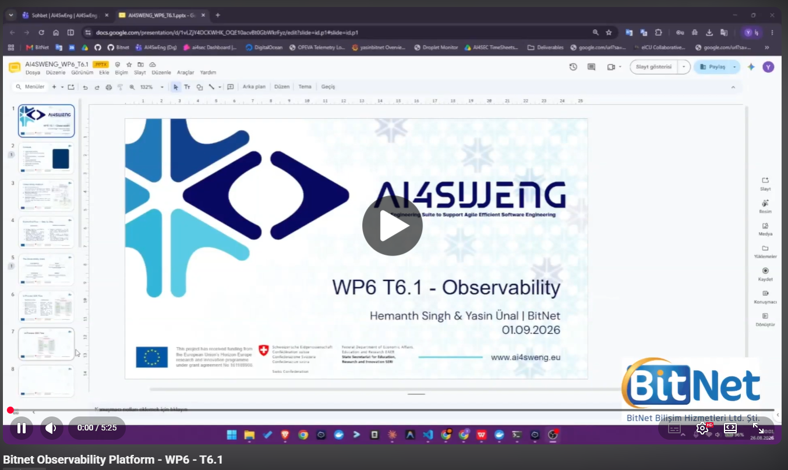
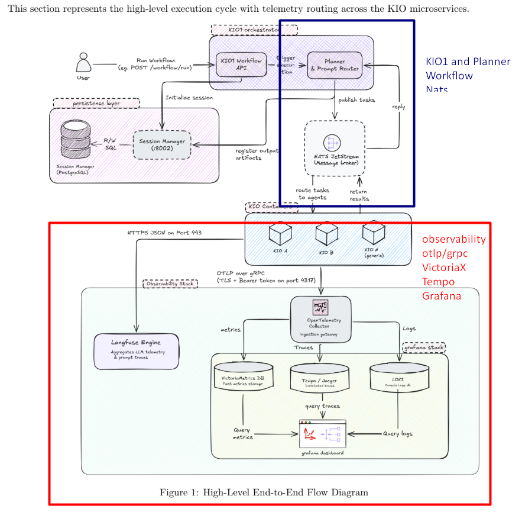

# AI4SWENG Observability Stack


<div align="center">
  <a href="[VIDEO_URL_HERE](https://www.youtube.com/watch?v=2chrEqgPCFQ)">
    
  </a>
</div>

<!-- **Notion Documentation: [AI4SWENG Observability - Grafana Metrik Sistemi](https://app.notion.com/p/dawn-squash-710/Observability-Grafana-Metrik-Sistemi-3a619cd5a4d88093a1fdebd6ada75f5a)** -->

Local implementation of the **[AI4SWENG Observability Integration Guide v2.2](docs/Observability_v2.2.docx)**
(normative, issued by the Central Platform Team to all KIO Consortium teams KIO2–KIO13
— read this first if you're integrating a new KIO). KIO modules push telemetry over
OTLP; the central platform stores it and Grafana visualizes it. Everything runs
locally via Docker Compose.


<div align="center">

  

</div>

 

## What's inside

| Component | Role | Port |
|-----------|------|------|
| `otel-collector` | Single OTLP ingestion gateway; fans metrics → VictoriaMetrics, logs → VictoriaLogs, traces → Tempo | 4317 (gRPC), 4318 (HTTP) |
| `victoriametrics` | Metrics store (Prometheus-compatible, no Prometheus needed) | 8428 |
| `victorialogs` | Store for unstructured / string telemetry | 9428 |
| `tempo` | Trace store (monolithic mode, local disk) — powers the trace waterfall view | 3200 |
| `grafana` | Dashboards (auto-provisioned) | 3000 |
| `langfuse-web` / `langfuse-worker` | Self-hosted Langfuse — LLM-specific prompt/completion/cost tracing, a stream parallel to and independent of OTel | 3001 (UI+API), internal 3030 (worker) |
| `postgres` / `clickhouse` / `redis` / `minio` | Langfuse's own required backing stores (relational DB, trace analytics, queue, blob storage) — not something we chose, this is Langfuse's mandated self-host footprint | internal only (127.0.0.1-bound except minio :9090) |
| ~~`nats` / `orchestrator-postgres` / `workflow-api` / `planner`~~ | **Disabled — commented out in `docker-compose.yml`.** These are the orchestration layer (task dispatch), which architecturally belongs to **KIO1**, not this observability platform — kept as reference only (see "Orchestration layer" below) | off |
| `kio2-sim` / `kio3` | KIO simulators pushing contract-compliant dummy telemetry, dual-written to OTel + Langfuse, each on its own internal timer (`kio2-sim` also drives the optional real-Ollama demo). More sims (`kio4`/`kio7`/`kio8`/`kio13`) are present but commented out — uncomment in `docker-compose.yml` to light up their D1.1 KPI panels | — |

The KIOs never run their own collector, never expose a scrape endpoint, and never
touch a database directly — exactly as the contract requires.

## Quick start

Works unmodified on both Windows (Docker Desktop) and Linux (native Docker
Engine, e.g. Ubuntu) — everything runs in containers with relative bind
mounts and standard Linux images; the only host-OS-sensitive bit
(`host.docker.internal` for the optional real-Ollama/GPU path) is handled via
`extra_hosts` in `docker-compose.yml`, see the "Real LLM integration"
section below.

All ports and passwords/keys are centralized: every one is overridable from a
single repo-root `.env` file (`cp .env.example .env`, then uncomment what you
need) — `docker-compose.yml` itself never needs editing. No `.env`? Every
default in `.env.example` is already baked in, so `docker compose up` works
as-is.

```bash
cd observability
docker compose up -d --build
```

Then open **http://localhost:3000** — anonymous browsing is on (Viewer role, no
login needed to look at dashboards); editing/deleting/datasources/alerting/user
management need the admin login (`admin` / `GF_SECURITY_ADMIN_PASSWORD` from
`.env.example`, rotate before any real/shared deployment). Two dashboards appear
under the **AI4SWENG** folder:

- **AI4SWENG — Overview (All KIOs)**: aggregate stats across every KIO — request &
  error rates, latency p95, token throughput, tokens/sec, GPU energy, cost, accuracy.
- **AI4SWENG — KIO Detail**: pick a KIO from the `KIO` dropdown; per-KIO metrics, a
  live panel of that KIO's unstructured string logs, and a **traces** section — a
  table of recent traces plus a waterfall view of the selected one (copy a Trace ID
  from the table into the `trace_id` box above it). Further down: a **gauge view**
  (colored green/orange/red bands, mirroring an external dashboard reference the
  team liked) for error rate, tokens/sec, and accuracy; a **power/efficiency/carbon**
  row (Watts, tokens-per-Watt, and an estimated kg-CO2e derived from energy — all
  pure PromQL, no new instrumentation); a **real GPU temperature** gauge (only
  populated when `KIO2_REAL_LLM_ENABLED=true` and NVML/power-exporter is reachable —
  "No data" otherwise is expected, not a bug); and a **simulated vs. real**
  before/after bar-chart row (energy, tokens/sec, latency) split by the `source`
  label.

Give it ~30–60 seconds after startup for the first metrics and traces to land.

Separately, **http://localhost:3001** opens the Langfuse UI (login
`admin@ai4sweng.local` / `ai4sweng-admin`, auto-created on first boot — see
Headless Initialization below). Langfuse takes noticeably longer to become ready
than the rest of the stack (~2–3 minutes: it's booting Postgres + ClickHouse +
Redis + MinIO underneath it) — the KIOs will log harmless connection-refused
retries against it until it's up, then start landing traces automatically.

Tear down (and wipe data): `docker compose down -v`

## The six KIO simulators

| KIO | LLM | Task type | Trigger | Notes |
|-----|-----|-----------|---------|-------|
| kio2-sim | `qwen2.5:3b` | code-analysis | internal timer | also reports **real** repo line/dir/file counts; **real Ollama tok/s + real GPU energy/temperature** (`KIO2_REAL_LLM_ENABLED=true`, see below). `kio2` itself is reserved for the real FocusTracer module — see `kio2-integration/README.md` |
| kio3 | `llama3.1:8b` | nlp-requirements (D1.1's KIO3) | internal timer **+** NATS (`kio.tasks.kio3`) | random dummy telemetry; D1.1 KPI 1.1 + 3.1 (simulated, `KIO_REAL_KPI_ROLE=nlp-requirements`) |
| kio4 | `gpt-4o-mini` | architecture-to-code (D1.1's KIO4) | internal timer **+** NATS (`kio.tasks.kio4`) | random dummy telemetry (non-zero cost); D1.1 KPI 1.1 + 3.1 + 3.2 (simulated, `KIO_REAL_KPI_ROLE=architecture-to-code`) |
| kio7 | `claude-sonnet` | ai-sysdev (D1.1's KIO7) | internal timer **+** NATS (`kio.tasks.kio7`) | random dummy telemetry; D1.1 KPI 4.1 + 5.1 + 7.1 + 9.1 + 9.2 (simulated, `KIO_REAL_KPI_ROLE=ai-sysdev`) — only the KPIs where KIO7 is a clear primary owner, not the full "most KPIs" D1.1 assigns it |
| kio8 | `gemini-1.5-pro` | green-deploy (D1.1's KIO8) | internal timer only (no NATS) | random dummy telemetry; D1.1 KPI 2.1 + 2.2 + 8.3 (simulated, `KIO_REAL_KPI_ROLE=green-deploy`) |
| kio13 | `gpt-4o-mini` | adoption (D1.1's KIO13) | internal timer only (no NATS) | random dummy telemetry; D1.1 KPI 8.1 + 8.2 (simulated, `KIO_REAL_KPI_ROLE=adoption`) — the only two D1.1 KPIs mapped to a single KIO with no co-owner |

`task_type` for kio3/kio4 was renamed 2026-08 from the arbitrary
`test-generation`/`debug` to match D1.1's actual KIO3/KIO4 identities, once
it became clear the D1.1 KPI traceability matrix's assignments (KPI 1.1, 3.1,
3.2) are keyed to those real roles, not to whatever this simulator happened
to call them first. kio7, kio8, kio13 were added the same way directly
against D1.1's KIO7/KIO8/KIO13 identities — kio8/kio13 close out D1.1's last
two uncovered KPIs (2.1/2.2/8.3 and 8.1/8.2). kio8/kio13 skip the NATS
trigger path since they have no real dispatch target behind them yet (see
the orchestrator's task_type routing table) — pure KPI simulators, timer-only.

kio3/kio4/kio7/kio8/kio13 are otherwise still random dummy data — no real LLM
is invoked for them. NATS-driven dispatch (via the Workflow API/Planner) is an
*additional* trigger path for kio3/kio4/kio7, not a replacement for the
internal timer — an earlier cut made it either/or, which meant these KIOs
went completely silent ("No data" everywhere) whenever nothing happened to
call the Workflow API. Both paths now run side by side for those three, so
they always keep producing baseline demo data. Adjust LLMs, task types, and
rates in `docker-compose.yml`, or edit `kio-simulator/kio_simulator.py`.

### Real vs. Simulated Data Map

Which panel/metric is real vs. simulated (dummy), and when — all distinguishable
in Grafana via the `source=real|simulated` label too (green=real, orange=simulated,
see the "Data source" panel):

| Metric / Panel | kio2-sim (`KIO2_REAL_LLM_ENABLED=false`) | kio2-sim (`=true`) | kio3 / kio4 |
|---|---|---|---|
| tok/s, `kio.llm.tokens_per_second` | simulated | **real** (Ollama `eval_count/eval_duration`) | always simulated |
| Energy (W/J), `kio.llm.energy_joules` | simulated (fixed per-model coefficient) | **real** (NVML / `tools/power_exporter.py`) | always simulated |
| GPU temperature, `kio.llm.gpu_temperature_celsius` | no data ("No data") | **real** (if NVML/power-exporter is reachable) | no data (no GPUs) |
| Error rate, `kio.request.error_count` | simulated (~7% random) | **real** (actual Ollama success/failure) | always simulated (~7% random) |
| Repo line/directory/file counts | **real** (scans its own source) | **real** | not applicable (not code-analysis) |
| Accuracy / fix@1, `kio.request.accuracy` | always simulated | always simulated (even with real Ollama) | always simulated |
| D1.1 KPIs (bug-fix time, issue resolution, slicing success, customer-reported) | always simulated (kio2-sim only, `KIO_REAL_KPI_ROLE=bugfix`) | always simulated | not applicable (kio3/kio4 have a different role — see below) |
| D1.1 KPIs (codegen duration, code quality, review score) | not applicable (these KPIs are kio3/kio4-specific) | not applicable | always simulated (`KIO_REAL_KPI_ROLE=nlp-requirements`/`architecture-to-code`) |
| D1.1 KPIs (dev productivity, time-to-market, cost saving, refactoring/tech-debt reduction) | not applicable (these KPIs are kio7-specific) | not applicable | not applicable — **kio7** only, always simulated (`KIO_REAL_KPI_ROLE=ai-sysdev`) |
| D1.1 KPIs (lifecycle energy, deploy energy efficiency, cross-arch build success) | not applicable (these KPIs are kio8-specific) | not applicable | not applicable — **kio8** only, always simulated (`KIO_REAL_KPI_ROLE=green-deploy`) |
| D1.1 KPIs (adoption rate, active usage, satisfaction/MOS) | not applicable (these KPIs are kio13-specific) | not applicable | not applicable — **kio13** only, always simulated (`KIO_REAL_KPI_ROLE=adoption`) |
| Cumulative CO2e (estimated) | estimate derived from simulated energy | estimate derived from real energy (still an estimate, not a real carbon measurement) | estimate derived from simulated energy |

fix@1 and every D1.1 project-level KPI never becomes "real" on any KIO, because
their real source is the actual real module in question (KIO2/FocusTracer —
Section 9.7/9.8, `kio2-integration/README.md`; KIO3/KIO4 have no real module
yet). Until that connection is made, everything produced here stays
deliberately simulated — "clearly labeled dummy data" was chosen over "empty
panel while waiting."

Each simulated request also emits a **trace**: a root `kio.request` span with
sequential child spans — `prepare_prompt` → `llm_call` → `postprocess` (code-analysis
KIOs add a leading `repo_scan` span). Timestamps are set explicitly to mirror the
request's real latency breakdown, so the waterfall in Grafana reflects the actual
timing split, not a fixed mock.

## Orchestration layer (NATS JetStream) — how KIOs get triggered

> **⚠️ Disabled by default — this belongs to KIO1, not the observability platform.**
> Architecturally the Workflow API + Planner (the "KIO1 orchestrator" in the v2
> guideline) are **KIO1's** responsibility; here they were only a *reference / demo*
> implementation to drive the simulators end-to-end. To keep this repository
> observability-only, the `nats`, `orchestrator-postgres`, `workflow-api` and
> `planner` services are **commented out in `docker-compose.yml`**, and the KIOs'
> `NATS_ENABLED` / `NATS_URL` / `depends_on` lines are neutralized so the stack
> stays valid without them. The `orchestrator/` code stays as a reference. Re-enable
> only if you deliberately want the dispatch demo (uncomment those services and
> restore the KIO NATS lines). The section below describes it as originally built.

Per the v2 guideline's architecture (Workflow API → Session Manager → Planner →
NATS JetStream → worker KIO → NATS → Planner → Session Manager lineage), this is now
implemented — see `orchestrator/`. This is a **separate concern from observability**:
it's about how a task gets *dispatched* to a KIO, not how that KIO reports telemetry.
A worker KIO's OTel/Langfuse instrumentation is identical either way.

```
POST /workflow/run  ──►  workflow-api  ──► Session Manager (Postgres: sessions)
                              │                      ▲
                              ▼                      │ lineage
                          Planner ──► NATS JetStream ──► worker KIO (kio3/kio4)
                              ▲                              │
                              └──────── kio.results.* ◄──────┘
```

- **`orchestrator/envelope.py`** — `KIOEnvelope` (task_type, session_id, kio_id, payload)
  and `KIOResult` (status, output, error). Vendored, byte-for-byte, into
  `kio-simulator/envelope.py` too, so kio-simulator's Docker build context doesn't need
  to change (see comment in that file for why).
- **`orchestrator/session_manager.py`** — registers sessions and records lineage in
  Postgres (`orchestrator-postgres`, schema in `orchestrator/postgres/init/001-schema.sql`).
  Portable to SQLite for local testing (`SESSION_DB_DSN=sqlite:///...`) — no code change.
- **`orchestrator/workflow_api.py`** — `POST /workflow/run` (`{"task_type", "payload",
  "target_kio"?}`) registers the session and hands off to the Planner, returns 202 +
  `session_id` immediately. `GET /workflow/{session_id}` shows status + lineage.
- **`orchestrator/planner.py`** — routes `task_type` → `kio_id` (a static table:
  `code-analysis→kio2-sim`, `nlp-requirements→kio3`, `architecture-to-code→kio4`,
  `ai-sysdev→kio7`, or an explicit `target_kio` override), builds the envelope, publishes
  to `kio.tasks.<kio_id>`. Also runs as its own long-running container, subscribed to
  `kio.results.*`, registering lineage as workers reply.
- **kio-simulator's NATS consumer** (`NATS_ENABLED=true`, on by default for kio3/kio4) —
  subscribes to its own `kio.tasks.<KIO_ID>`, runs the exact same `simulate_request()`
  used in internal-timer mode (just fed the envelope's `session_id` instead of
  generating its own), publishes a `KIOResult` back to `kio.results.<KIO_ID>`.

**Scope, stated plainly:** the "Planner & Prompt Router" here is a static routing table,
not a real multi-step LangGraph workflow graph (conditional branching, multi-KIO
pipelines, retries) — that's real future work, this just gives every envelope a
genuine destination and closes the loop honestly. Tested at the logic level (a fake
pub/sub double standing in for NATS, SQLite standing in for Postgres — no Docker in the
dev sandbox this was built in); the real NATS wire protocol and the real Postgres schema
still want one live `docker compose up` verification pass on an actual machine.

Try it:
```bash
curl -X POST http://localhost:8080/workflow/run \
  -H "Content-Type: application/json" \
  -d '{"task_type": "architecture-to-code"}'
# -> 202 {"session_id": "...", "kio_id": "kio4", "status": "accepted"}
curl http://localhost:8080/workflow/{session_id}
# -> {"session": {...}, "lineage": [...]}
```

### Orchestration verification

Instead of re-running the `curl` example above by hand every time, there's a
script that verifies the whole chain in one pass (`POST /workflow/run` → NATS
JetStream → kio3's NATS consumer → `kio.results.kio3` → the Planner's
`run_result_listener` → Postgres lineage), with no extra packages to install
(stdlib-only):

```bash
docker compose up -d nats orchestrator-postgres workflow-api planner kio3
python scripts/verify_orchestration.py
```

Exits with `PASS`/`FAIL`; on `FAIL` it prints exactly which hop broke (Workflow
API unreachable at all / lineage never arrives / etc.) and which container's
logs to check. This step has never been run against a real NATS/Postgres,
since the sandbox this repo was developed in has no Docker — running this
script closes the last open verification item flagged in the "v2 Guideline
Evaluation" section of this README.

## Running a KIO on a different machine

The `remote-kio/` folder is the single home for connecting a KIO that runs on a
**separate machine** (same LAN, or a different network via Tailscale/VPN) while
the rest of the stack keeps running wherever it already is. The architecture is
push-based by design, so this needs no code change — only pointing
`OTEL_EXPORTER_OTLP_ENDPOINT` at the central machine.

A different developer connecting **their own KIO module** (its own codebase, not
our simulator, and **no Docker required**) starts at
**[`remote-kio/INTEGRATION.md`](remote-kio/INTEGRATION.md)** — an end-to-end guide
that also documents the exact data/naming contract and non-Docker deployment —
plus two copy-and-edit examples that each push the mandatory telemetry from
`.env`: **[`remote-kio/with_script/`](remote-kio/with_script/)** (plain Python)
and **[`remote-kio/with_docker/`](remote-kio/with_docker/)** (containerized),
each with a `check_connectivity.py` preflight.

Networking (firewall on both sides, static IP, Tailscale) is common to both and
documented once in **[`remote-kio/NETWORK.md`](remote-kio/NETWORK.md)**.

## How a new KIO (KIOx) connects from scratch

For a new KIO team with their own codebase — one that will never use this
repo's `kio-simulator.py` — the starting point is always
**[`docs/Observability_v2.2.docx`](docs/Observability_v2.2.docx)**.
There's no "send whatever metrics you like" here; it's a normative guide:

1. **§1 Onboarding**: an OTLP Bearer token + Langfuse project keys are requested
   from the central platform team; the `OTEL_EXPORTER_OTLP_ENDPOINT` /
   `OTEL_RESOURCE_ATTRIBUTES` / `LANGFUSE_*` environment variables are set; the
   "verification gate" is `kio.heartbeat` showing up in Grafana and at least one
   trace showing up in Langfuse — a KIO isn't considered onboarded until both
   are visible. **The Bearer token is now genuinely enforced (2026-08, §9.3)**
   — without `OTEL_EXPORTER_OTLP_HEADERS` the collector rejects the OTLP call
   outright (both gRPC and HTTP, 4317 and 4318); previously this was only a
   contractual requirement, not technically enforced.
2. **§2.1 Mandatory metric set** — 7 metrics, fixed name/type/unit/labels (see
   "Metrics" below): `kio.request.count`, `kio.request.duration_ms`,
   `kio.request.error_count`, `kio.llm.token_count`, `kio.llm.cost_usd`,
   `kio.session.active_count`, `kio.heartbeat`. These are not negotiable.
3. **The G1–G7 rules** — the naming pattern (`kio.<domain>.<metric>`), mandatory
   correlation keys (`kio.id`, `session.id`), a ban on high-cardinality labels /
   PII / secrets. **G7: anything beyond the mandatory 7 is self-service** — as
   long as a KIOx follows these rules, it can define its own domain-specific
   metrics (this repo's `kio.llm.tokens_per_second`, `kio.llm.energy_joules`,
   and the D1.1 KPI metrics were all added this way — none of them are on the
   contract's mandatory list).
4. The contract appendix's reference Python implementation (`MeterProvider`
   setup, instrument definitions, heartbeat loop) is a directly copyable
   starting point.

**This is a completely separate concern from the Planner/NATS.** Complying with
the contract (sending telemetry) is mandatory; registering with the Workflow
API/Planner/NATS in `orchestrator/` is **optional** — only needed if you want
your KIO to be triggerable by our `POST /workflow/run` call (see the
"Orchestration layer" section above). If you don't need that (e.g. FocusTracer's
CLI-based execution model — see `kio2-integration/README.md`), you can keep
sending contract-compliant telemetry without ever registering — `kio.heartbeat`
plus the mandatory metrics is enough.

Concrete examples in this repo: for connecting a module with your own codebase
(whether on a different machine or not) from scratch, an end-to-end guide plus
two copyable, runnable examples — `remote-kio/INTEGRATION.md` and
`remote-kio/with_script/` (plain Python) / `remote-kio/with_docker/`
(containerized), each shipping `kio_otel.py` (a minimal helper implementing only
the mandatory contract) and `check_connectivity.py` (a pre-flight test); for a
line-referenced guide to connecting the real FocusTracer module under the KIO2
identity, `kio2-integration/README.md`.

## KIO2 real-module integration (FocusTracer)

The guide for how the FocusTracer team connects their own module once it's
complete lives in **[`kio2-integration/README.md`](kio2-integration/README.md)**
— instructions specific to FocusTracer's own code, with line references
(exactly where to add which OTel call, which metrics can be sourced for real
from the `explain`/`slice` commands, why fix@1 is out of FocusTracer's scope).
The `kio2` identity is now reserved for the real module; the former simulator
was renamed to `kio2-sim` and keeps running in parallel for comparison
(`docker-compose.yml`).

## Metrics (Integration Contract §2.1 + optional extras)

Mandatory set, all carrying `kio_id`:

- `kio_request_count` (counter; labels `kio_id`, `status`)
- `kio_request_duration_ms` (histogram → `_bucket` / `_sum` / `_count`)
- `kio_request_error_count` (counter; `error_type`)
- `kio_llm_token_count` (counter; `direction` = input/output)
- `kio_llm_cost_usd` (counter)
- `kio_session_active_count` (up/down counter)
- `kio_heartbeat` (counter; ticks every 60s — a KIO silent >120s is "stale", enforced
  by a real Grafana alert rule, see `grafana/provisioning/alerting/rules.yml`, plus a
  visual "Stale KIO Check" table on the Overview dashboard — not just a manual check
  anymore)

Optional self-service metrics (contract rule G7, meeting requirements):

- `kio_llm_tokens_per_second` (histogram)
- `kio_llm_energy_joules` (counter — GPU energy during token generation)
- `kio_request_accuracy` (histogram)
- `kio_repo_line_count` / `kio_repo_directory_count` / `kio_repo_file_count` (gauges, code-analysis KIO only)

Labels `llm` and `task_type` are attached to every metric so dashboards can slice by
model and by KIO. (Metric-name suffixing is disabled in the collector, so names stay
clean — no `_total` suffix.)

## Unstructured / string telemetry

Free-form strings (LLM output snippets, analysis notes, failure summaries) are sent as
**OTLP logs** and stored in **VictoriaLogs**, since VictoriaMetrics can only hold
numeric series. They show up in the log panel on the KIO Detail dashboard. Query them
directly with LogsQL, e.g. `kio.id:kio2` or `_msg:~"coverage"`.

## Traces

Each request's `kio.request` trace (with its `prepare_prompt` / `repo_scan` /
`llm_call` / `postprocess` children) is exported to **Tempo**. The KIO Detail
dashboard exposes it two ways: a TraceQL-backed table of recent traces for the
selected KIO, and a waterfall panel that renders the full span sequence once you
paste a Trace ID from that table into the `trace_id` variable. If the waterfall
panel ever comes up empty, the same Trace ID can always be opened via
**Explore → Tempo** in Grafana as a fallback.

## Real project KPIs (D1.1)

`docs/AI4SWENG_KPI_Metrik_Referansi_v1.3.docx` — the full catalog of every KPI
(1.1–9.2) and work-package/task-level metric from the project's official
Project Management Handbook (D1.1), plus the mapping of which KPI belongs to
which KIO.

Six KIOs' real D1.1 KPIs are enabled via the `KIO_REAL_KPI_ROLE` env var
(`docker-compose.yml`), each publishing its own metric set in
`kio_simulator.py` (names/units taken directly from D1.1, values still
simulated):

- **kio2-sim** (`KIO_REAL_KPI_ROLE=bugfix`, D1.1's "Bug Locate & Fix / LLM
  Debugger" — exactly the job FocusTracer does):
  - `kio_bugfix_duration_hours` — KPI 6.1 (Bug-fix time)
  - `kio_issue_resolution_hours` — KPI 1.2 (Issue resolution speed)
  - `kio_slicing_success_rate` — WP3 task metric (Dynamic slicing success rate, target ≥85%)
  - `kio_issue_customer_reported_count` — KPI 6.2 (Customer-reported issues)
- **kio3** (`KIO_REAL_KPI_ROLE=nlp-requirements`, D1.1's "NLP → Formal Requirements"):
  - `kio_codegen_duration_minutes` — KPI 1.1 (Code generation speed)
  - `kio_code_quality_score_pct` — KPI 3.1 (Code quality improvement)
- **kio4** (`KIO_REAL_KPI_ROLE=architecture-to-code`, D1.1's "Architecture-to-Code Planner"):
  - `kio_codegen_duration_minutes`, `kio_code_quality_score_pct` (same as kio3, KPI 1.1 + 3.1)
  - `kio_review_score` — KPI 3.2 (Review score increase, KIO4 only)
- **kio7** (`KIO_REAL_KPI_ROLE=ai-sysdev`, D1.1's "AI-SysDev" — shared across most
  KPIs (1.1, 1.2, 2.x, 3.x, 4.1, 5.1, 6.x, 7.1, 9.x); only the five where KIO7 is
  a clear primary owner and not already covered by the other three KIOs are simulated):
  - `kio_dev_productivity_features_per_day` — KPI 4.1 (Developer productivity)
  - `kio_time_to_market_days` — KPI 5.1 (Time-to-Market)
  - `kio_cost_saving_pct` — KPI 7.1 (Annual cost saving)
  - `kio_refactoring_hours_per_feature` — KPI 9.1 (Refactoring effort reduction)
  - `kio_tech_debt_hours_per_100loc` — KPI 9.2 (Technical debt reduction)
- **kio8** (`KIO_REAL_KPI_ROLE=green-deploy`, D1.1's "Cross-Architecture /
  Energy-Efficient Deploy" — shares KPI 2.1/2.2 with KIO7/KIO10, sole owner of KPI 8.3):
  - `kio_lifecycle_energy_pct_of_baseline` — KPI 2.1 (Lifecycle energy reduction)
  - `kio_deploy_energy_tokens_per_s_per_w` — KPI 2.2 (Deployment energy efficiency)
  - `kio_cross_arch_build_success_count` — KPI 8.3 (Cross-Architecture Build Success Rate)
- **kio13** (`KIO_REAL_KPI_ROLE=adoption`, D1.1's "Adoption & Usage Tracking" —
  owner of the only two D1.1 KPIs not shared with any other KIO):
  - `kio_adoption_active_user_pct` — KPI 8.1 (Adoption rate)
  - `kio_adoption_usage_pct`, `kio_adoption_mos_score` — KPI 8.2 (Active usage & satisfaction)

Note: kio3/kio4's `task_type` was renamed in 2026-08 (`test-generation`/`debug`
→ `nlp-requirements`/`architecture-to-code`) to match D1.1's actual KIO3/KIO4
identities — D1.1's KPI assignments are keyed to those real roles, not to
whatever arbitrary name the simulator first picked. kio7/kio8/kio13 were added
the same way, directly against D1.1's corresponding identities. kio7's
`ai-sysdev` role deliberately left KPI 2.1/2.2 out (see the comment in
`kio_simulator.py`) — those two are implemented here under kio8 instead,
D1.1's clearer/more specific owner.

The "D1.1 Real Project KPIs" sections on the KIO Detail dashboard show these
metrics (populated only when the selected KIO has the matching
`KIO_REAL_KPI_ROLE`, "N/A" otherwise — see "Real vs. Simulated Data Map"). Every
KIO D1.1 assigns a KPI to (KIO2, KIO3, KIO4, KIO7, KIO8, KIO13) is now
integrated; all 16 of D1.1's KPIs (1.1–9.2) are visible via simulated data
through at least one KIO. See the "Other KIOs — Status" section of the
reference document.

## Real LLM integration (KIO2, optional — requires an NVIDIA GPU)

Since KIO2's real module (FocusTracer) isn't connected yet, this path exists on
`kio2-sim` to at least **actually run a real LLM** and measure tokens/sec and
GPU energy for real in the meantime. Off by default (`KIO2_REAL_LLM_ENABLED`
defaults to `"false"` in `docker-compose.yml`) — since this path runs
independently of the FocusTracer connection, it can be turned on whenever
needed (e.g. for a demo) via `KIO2_REAL_LLM_ENABLED=true` in `.env` without
waiting for that handoff; it defaults off only because it requires a real
Ollama + GPU on the host (which a headless remote test server may not have).
What changes when it's on:

- **Real:** tokens/sec, input/output token counts, and latency (from Ollama's
  own `eval_count`/`eval_duration`), GPU energy AND GPU temperature (the
  integral of a real NVML reading over the call's duration / an instantaneous
  reading), **and now the error rate too** — if the Ollama call genuinely fails
  (unreachable/timeout/HTTP error), this is recorded as a real error with a
  real `error_type` on `kio.request.error_count`, not a random dice roll.
  Previously, even with the real path on, the error rate still came from the
  same 7% random dice roll, and a real Ollama outage would be papered over by
  a fresh fake "successful" request right after, as if nothing had happened —
  this is fixed (`_call_ollama_real()` now returns a dict that explicitly
  distinguishes success from failure; `simulate_request()` branches three ways:
  real-success / real-failure / path-fully-off).
- **Still simulated:** fix@1 (`kio.fix.attempt_count`, `outcome=success|failure`)
  — because judging a "correct fix" needs a real bug plus a real test run,
  which is FocusTracer's job. Once FocusTracer is ready, it will be enough to
  swap the body of `_evaluate_fix_success()` in `kio_simulator.py` — the metric
  name/shape stays the same. `kio.request.accuracy` (the general Contract
  metric, independent of D1.1/fix@1) also stays simulated for the same reason
  — there's no reference/test set to automatically score an LLM answer's
  "correctness."

Setup (same steps on a Windows or Linux host):
1. Have Ollama installed on this machine (not inside a container) with the model already pulled: `ollama pull qwen2.5:3b`
2. (Optional, for real energy) `pip install nvidia-ml-py`, then run `python tools/power_exporter.py` — reads from NVML on the host (Windows or Linux) and serves JSON over `http://localhost:9400/power` (`{"watts": 87.3, "temperature_c": 61.5}` — `temperature_c` was added in 2026-08 for KIO Detail's GPU temperature gauge; silently omitted on older exporter/NVML versions that don't have it). If you skip this, energy falls back to the old estimated formula and the system still runs fine.
3. Add `KIO2_REAL_LLM_ENABLED=true` to a `.env` file at the repo root (start from `cp .env.example .env` if you don't have one), then restart with `docker compose up -d --build kio2-sim`; to turn it off again, delete the line or set it to `false` (the default is already `false`).

Why this approach (native Ollama on the host + a separate power-exporter
script, instead of GPU passthrough into the container)? Linux containers have
no visibility into the host's GPU unless passthrough is separately configured
(possible on Linux via `nvidia-container-toolkit`, but not used here); Ollama
already runs natively on the host (Windows or Linux, doesn't matter) and can
use the GPU directly, which is the lowest-friction path.
`_read_gpu_power_watts()` tries `GPU_POWER_EXPORTER_URL` first, then the
container's own NVML if available, and silently falls back to the old
estimated value if neither works — the simulator never crashes either way.

**Windows/Linux difference — `host.docker.internal`:** `OLLAMA_ENDPOINT` and
`GPU_POWER_EXPORTER_URL` reach the host from inside the container via this DNS
name. Docker Desktop (Windows/Mac) resolves it automatically; native Linux
Docker Engine (e.g. Docker installed on an Ubuntu server without Docker
Desktop) does not — which is why `docker-compose.yml` adds
`extra_hosts: ["host.docker.internal:host-gateway"]` to the `kio2-sim` service
(requires Docker Engine 20.10+). This line is harmless on Docker Desktop too,
resolving to the same address — a single `docker-compose.yml` works on both
Windows and Linux with no changes needed.

## Langfuse (LLM-specific tracing)

A second, parallel telemetry stream — independent of the OTel pipeline — dedicated
to prompt/completion/cost tracking. Each KIO wraps its simulated LLM call in a
Langfuse span+generation (same `session_id` as the OTel trace, so a human can
correlate the two), while metrics/logs/traces above keep flowing through OTel
exactly as before. If Langfuse is unreachable or misconfigured, the KIO logs a
warning and keeps running unaffected — this stream can never take down the rest
of the stack (see `kio_simulator.py`'s `emit_langfuse_trace()`).

Self-hosted via `LANGFUSE_INIT_*` "headless initialization" env vars on
`langfuse-web`, so the org/project/API-keys exist automatically on first boot —
no manual UI setup step, no copy-pasting keys before the KIOs can connect.

**If you're running this on a remote Ubuntu server and connecting from a
different machine** (e.g. `docker compose up` runs on an Ubuntu server, but
the browser is on your Windows machine): `NEXTAUTH_URL` and
`LANGFUSE_S3_MEDIA_UPLOAD_ENDPOINT` default to `localhost`, which only
resolves correctly from the machine Docker itself is running on. Create a
`.env` file at the repo root (copy from `.env.example`) and set
`PUBLIC_HOST=<the server's IP/hostname>` — otherwise Langfuse login (NextAuth
redirects to the wrong host) and multi-modal media previews (presigned URLs
pointing at the wrong host) break. Core OTel telemetry (Grafana/traces/
metrics/logs) and Langfuse's own trace/cost data are unaffected either way —
they already use Docker-internal addresses like `otel-collector`/`minio`. For
local use (Docker and the browser on the same machine, whichever OS — Windows
or Linux doesn't matter) you don't need to do anything, the default
`localhost` is already correct.

## V2 Guideline Evaluation (2026-07-23)

A candidate engineer's proposed **v2 Observability Integration Guide** was reviewed
against this implementation. It is a candidate's proposal, not a finalized
contract — the decisions below are ours, made after comparing the two documents:

- **Log collection: kept our design (active OTLP push → VictoriaLogs), rejected
  v2's passive stdout-scrape → Loki model.** v2 assumes the collector can reach
  every KIO's container filesystem/stdout directly (e.g. via a mounted Docker log
  directory). That assumption breaks for a KIO running on a separate machine —
  exactly the `remote-kio/` scenario already implemented and tested in this repo
  (KIO5 over Tailscale). An OTLP-push model works uniformly regardless of where a
  KIO physically runs; a scrape-based model does not. Decision: OTLP push stays.
- **Langfuse: added**, per direct request (senior). Self-hosted stack (Postgres +
  ClickHouse + Redis + MinIO + langfuse-web/-worker) — see "Langfuse" section
  above. This is a materially heavier addition than everything else in this repo
  combined (6 extra containers vs. our previous 8 total), so it's worth being
  explicit about the trade-off for the report: it buys prompt/completion-level
  replay and LLM cost analytics that Tempo's generic spans don't provide. If the
  team ultimately doesn't need prompt-level debugging, this whole sub-stack (and
  its 4 backing services) can be removed without touching the OTel pipeline at
  all — it was deliberately kept as an isolated, independently-failing addition.
- **NATS JetStream / Session Manager / PostgreSQL lineage / Workflow API:
  implemented (2026-08), scoped.** Originally deferred as "a different team's
  concern" — reversed after an explicit decision to accelerate this. See
  "Orchestration layer" above for the architecture and `orchestrator/` for the
  code. Scope is stated there too: the Planner is a static routing table, not a
  full LangGraph workflow graph. Tested at the logic level (fake pub/sub + SQLite,
  no Docker available in the dev sandbox this was built in) — kio3/kio4 are wired
  to it; kio2-sim stays on its internal timer so the real-Ollama demo isn't
  disrupted. A live `docker compose up` pass against the real NATS/Postgres is
  the remaining verification step — run `python scripts/verify_orchestration.py`
  after bringing the stack up (see "Orchestration verification" below); it drives
  the whole round trip (`POST /workflow/run` -> NATS -> kio3 -> `kio.results.kio3`
  -> Planner -> Postgres lineage) and prints exactly which hop failed if it doesn't.
- **Confirmed already-compliant, no change needed:** the 7 mandatory metrics
  (names/types/units), resource attributes, the low-cardinality rule (session IDs
  never used as metric labels — only in trace/log metadata, exactly as v2 also
  specifies), and the metrics+traces-over-OTLP/gRPC transport.
- **Adopted (2026-08):** v2's 15s metric export interval (was 5s — bumped across
  all 6 KIO simulators' `EXPORT_INTERVAL_MS` default in `docker-compose.yml`/
  `.env.example`/`kio_simulator.py`'s own fallback; no
  panel changes needed, existing `rate(...[15m])` windows comfortably contain
  multiple 15s samples) and a `$session_id` Grafana dashboard filter variable
  (textbox, regex, default `.*` = all — wired into the log-stream panel via
  VictoriaLogs LogsQL's `field:~"regex"` syntax and the Tempo trace table via
  TraceQL's `=~` operator; the LogsQL syntax is unverified against a live
  VictoriaLogs instance, first real `docker compose up` should confirm it).
  Metrics themselves still never carry `session_id` as a label (low-cardinality
  rule) — the new variable only filters the log/trace panels, matching v2's own
  metric-label rules.

## Tests (pytest)

There's a permanent pytest suite under `tests/` covering
`kio-simulator/kio_simulator.py` (D1.1 KPI emission for every role, the 3
fallback tiers of the real GPU temperature reading, the NATS task handler,
`simulate_request()`'s simulated/real-success/real-failure branches) and
`orchestrator/` (the Planner's routing table + dispatch, the Session Manager's
CRUD tested via SQLite):

```bash
pip install -r kio-simulator/requirements.txt -r orchestrator/requirements.txt \
            -r tests/requirements-test.txt
pytest
```

No real OTel collector/NATS/Postgres is required — every external dependency
is faked (the OTLP exporters silently fall back when the endpoint is
unreachable, NATS via a fake `nc`, Postgres via `sqlite:///:memory:`).

## Design notes & decisions

- **Prometheus is intentionally absent** — VictoriaMetrics ingests via remote_write
  (push), which fits the contract's "KIOs never expose a scrape endpoint" rule.
- **Tempo** stores traces in monolithic mode with local-disk storage — sufficient for
  local dev; a production deployment would move to object storage (S3/GCS) and
  split Tempo's components.
- **Langfuse** is now integrated (see "Langfuse" section above) as a second stream
  parallel to metrics + logs + traces, added per direct request and evaluated
  against v2 in the section above.
- **Auth/TLS (2026-08, §9.3): Bearer done, TLS still deferred.** The contract uses
  Bearer token + TLS on `:4317`/`:4318`. The collector's `bearertokenauth`
  extension (`otel-collector/config.yaml`) now enforces the Bearer half on both
  gRPC and HTTP — every KIO in `docker-compose.yml` sends
  `OTEL_EXPORTER_OTLP_HEADERS="Authorization=Bearer $OTLP_BEARER_TOKEN"` (shared
  value, set via `.env`'s `OTLP_BEARER_TOKEN`, default `local-dev-otlp-token`; no
  `kio_simulator.py` code change needed — the OTel SDK reads this env var on its
  own). TLS itself is still not enabled — the connection is authenticated but not
  encrypted, fine for a trusted LAN/VPN, not for the open internet. Real TLS
  (certs on the collector, `insecure=False` on every client) is left for an
  actual remote/production deployment, not this docker-compose.
- **Remote KIOs**: fully supported today via the push architecture — see
  `remote-kio/README.md`. No code change is required, only environment variables.
- **Grafana access (2026-08):** anonymous viewers, not anonymous admins. Until
  now `GF_AUTH_ANONYMOUS_ORG_ROLE=Admin` meant anyone who could reach `:3000` —
  no login at all — got full edit/delete/datasource/alerting/user-management
  rights. Harmless on localhost-only, a real problem the moment this port is
  reachable over Tailscale/LAN/internet (which is exactly the direction this
  project is heading with remote KIOs). Now: anonymous role is `Viewer`
  (dashboards stay fully browsable with zero login, matching the "let anyone
  look" intent), and the default admin password was rotated off `admin` to a
  random placeholder in `.env.example` — still rotate it yourself before any
  real/shared deployment, this is still a shared local-dev default.

## Layout

```
observability/
├── docs/Observability_v2.2.docx              # normative guide (v2.2) — start here for a new KIO
├── docker-compose.yml
├── pytest.ini
├── otel-collector/config.yaml
├── tempo/tempo.yaml
├── grafana/
│   ├── provisioning/datasources/datasources.yml
│   ├── provisioning/dashboards/dashboards.yml
│   ├── provisioning/alerting/rules.yml       # Stale KIO alert (Contract §2.3)
│   └── dashboards/{ai4sweng-overview,ai4sweng-kio}.json
├── kio-simulator/{kio_simulator.py,requirements.txt,Dockerfile}
├── orchestrator/{planner.py,session_manager.py,workflow_api.py,envelope.py}
├── remote-kio/                              # connect a KIO from another machine
│   ├── {README.md,INTEGRATION.md,NETWORK.md}   # hub / own-module guide / networking
│   ├── with_script/{main.py,kio_otel.py,check_connectivity.py,requirements.txt,.env.example}
│   └── with_docker/{Dockerfile,docker-compose.yml,main.py,kio_otel.py,check_connectivity.py,…}
├── tests/{conftest.py,requirements-test.txt,kio_simulator/,orchestrator/}
└── docs/                                     # v2.2 guide, technical reports, KPI reference
```
